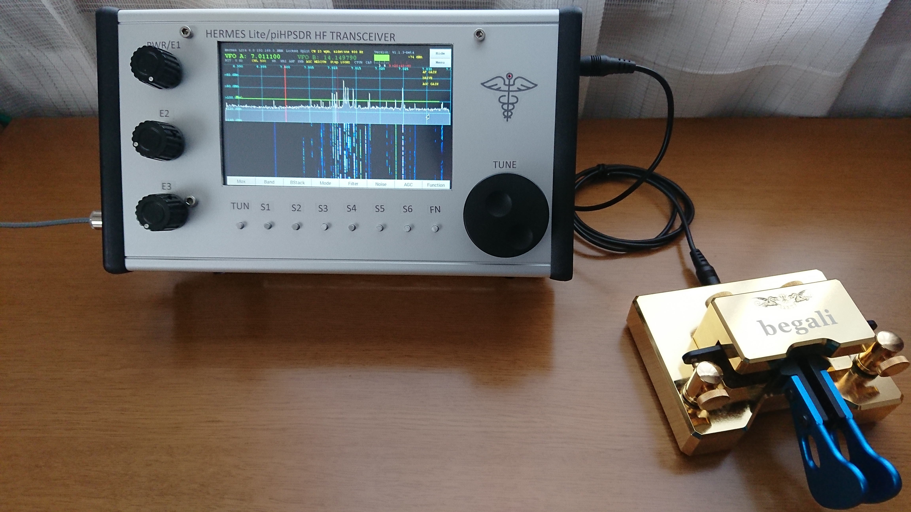
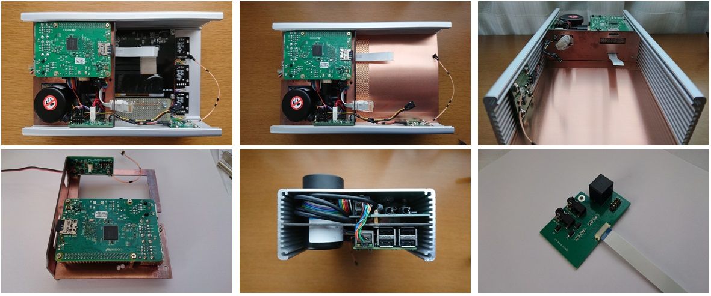
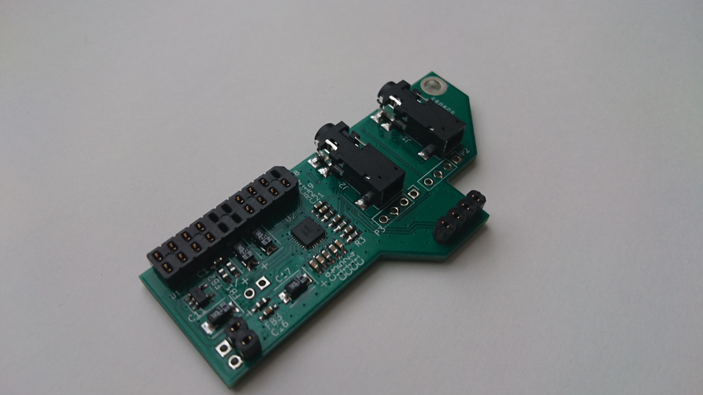
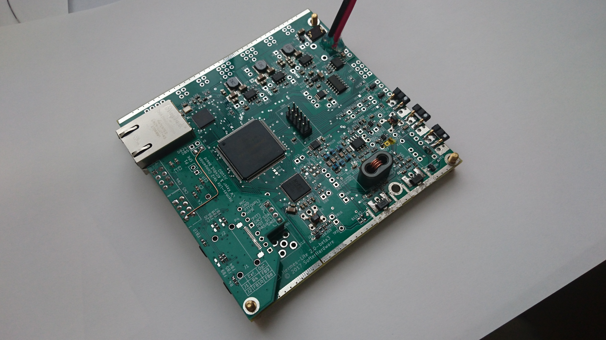
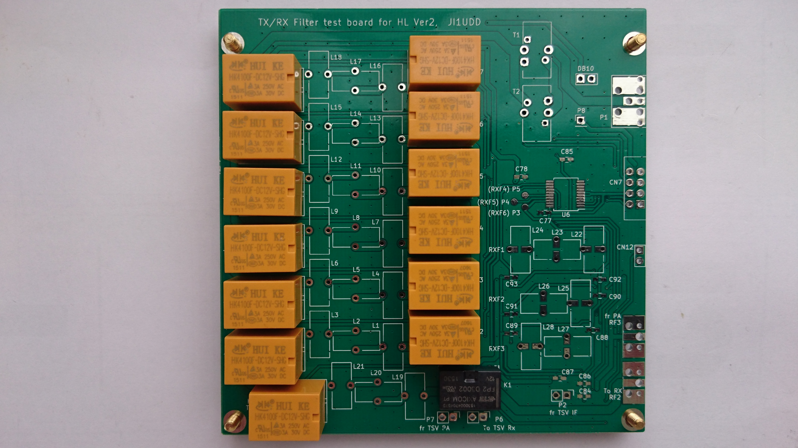
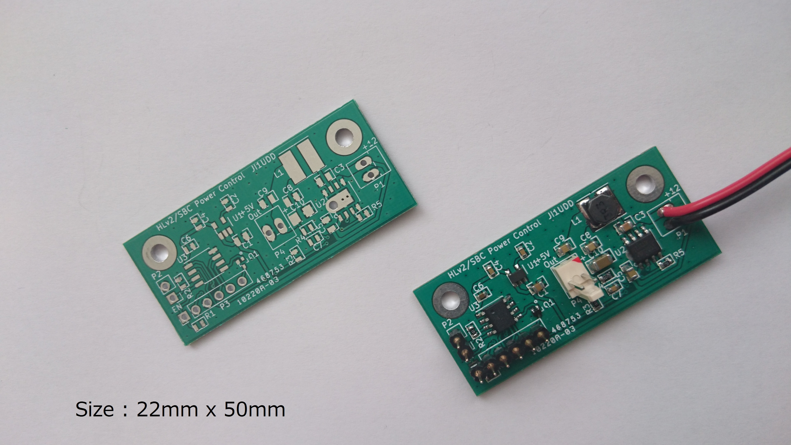
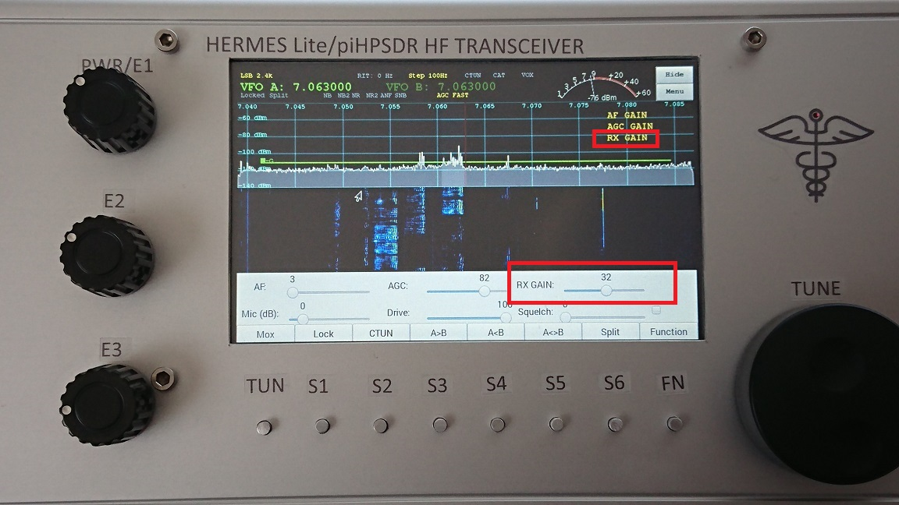
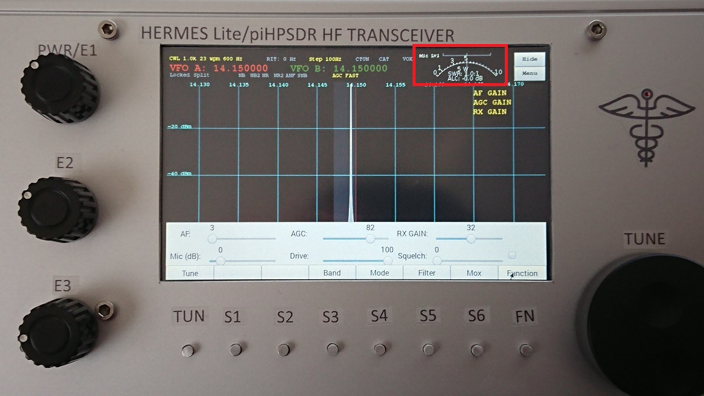

#  ji1udd Hermes-Lite Ver2 (beta3) compact tranceiver
## Outline
This is HF QRP SDR compact transceiver that consists of Hermes-Lite Ver2 beta3 and Raspberry Pi. (updated: 19 Oct 2017)

### Enclosure
Hammond 1455Q2201 (220mm x 125mm x 51.5mm)

### Main parts 
Hermes-Lite Ver2, Raspberry Pi 2B, 5" HDMI Monitor, Power Control board, Audio codec board, KY-040 rotary encoder(x3), 600ppr rotary encoder

### Photos

[TRX Schematic (updated: 19 Oct 2017)](compact-trx/powercontrol/docs/trx_schematic.pdf)

## CW Keyer I/F and AK4951 audio codec board

In this [Test Video](https://youtu.be/d-YUDK2JaQg), this board was used with HL v2 Beta3.

[Schematic](compact-trx/Keyer_AK4951/docs/AudioCodec_AK4951_r201.pdf)
[BOM](compact-trx/Keyer_AK4951/docs/BOM_AK4951_Codec_rev2.pdf)
[Gerber](compact-trx/Keyer_AK4951/gerber/hl2ac4951.zip)
[Errata](compact-trx/Keyer_AK4951/docs/KeyerIF_AK4951_v2.0.1_PCB_Errata.pdf)
[Installation guide](compact-trx/Keyer_AK4951/docs/KeyerIF_AK4951_v2.0.1_PCB_Installation_guide.pdf)

Verilog-HDL code was released on my git (updated: 19 Oct 2017).  

## Tx Rx Filter test board (updated: 19 Oct 2017)

[Schematic](compact-trx/TX_RX_Filter/docs/Filter_test_board.pdf)
[BOM](compact-trx/TX_RX_Filter/docs/BOM_FILTER.pdf)
[Gerber](compact-trx/TX_RX_Filter/gerber/hl2filter.zip)
[Errata](compact-trx/TX_RX_Filter/docs/Tx_Rx_Filter_v1.0_PCB_Errata.pdf)

## Power control board

### Purpose
- Turn tranceiver on and off easily.
- Turn RPi off automatically after shut down process has been completed.
- Control Hermes-Lite and RPi+Monitor power individually by hooking one of rotary encoder push switches, without any additional switch. and keep an origianl rotary encoder push switch function.

In this [Test Video](https://youtu.be/TSX1PIrnZoY), power control board was used with HL v1.22. I put an [additional circuit](compact-trx/powercontrol/docs/Add-on-PMOS-switch.png) between power source and HL v1.22.

### Function
#### 1) Power ON
- Turn on both HL and RPi+Monitor (hold Power SW down less than 3sec)
- Turn on only HL  (hold down more than 3sec and less than 7sec)
- Turn on only RPi+Monitor (hold down more than 7sec)

#### 2) Power OFF
- hold down more than 3sec.

#### 3) Use Power SW as original function switch when RPi is on.
- hold down less than 3sec.

#### 4) Shift only HL on to both on.
- hold down less than 3sec.

For more detail, please refer to [state diagram](compact-trx/powercontrol/docs/PowerControl_state_diagram.pdf).

### Power consumption (RPi+Monitor, without HL)
- Standby: 240uA at 13.8V supply. If AP2204 is used, standby current will be reduced.
- Operating(after boot up OS): 300mA at 13.8V supply.

### Hardware
[Schematic](compact-trx/powercontrol/docs/PowerControl_v11.pdf)
[BOM](compact-trx/powercontrol/docs/BOM_PwrCtrl.pdf)
[Gerber](compact-trx/powercontrol/gerber/PowerControl.zip)

### PIC software
I used legacy MPLAB IDE v8.92, XC8 C compiler v1.33 and ICD2.

[source file(.c)](compact-trx/powercontrol/software/pic12f1822/HL2_Power_Control.c)
[object file(.hex)](compact-trx/powercontrol/software/pic12f1822/HL2_Power_Control.hex)

If you want to adjust turn off delay time after SBC status stop, adjust parameter "Power off delay" in C source file. The current setting is 600 (6sec).

### Raspberry Pi software & setting
#### 1) GPIO setting for RPi status output
     $ sudo nano /boot/config.txt

  add the followng line at the end of file

    dtparam=act_led_gpio=4

#### 2) shutdown script
  Store [shutdown.py](compact-trx/powercontrol/software/RaspberryPi/shutdown.py) into /home/pi. aftar that,

    $ sudo chmod 755 shutdown.py

  If you change GPIO assignment, this script and above status output setting should be changed properly.

#### 3) Start the script after RPi boot up
    $ sudo nano /etc/rc.local

  add the followng line before "exit 0"

     /home/pi/shutdown.py
     exit 0

#### 4) Start PiHPSDR after RPi boot up
    Please refer to official PiHPSDR installation document.

## piHPSDR customize

### 1) Slider: RX GAIN
RX GAIN (AD9866 RxPGA) can be used instead of not-implemented Attenuator function.
Slider position 0 means -12dB setting,60 means +48dB.

[Modification document](compact-trx/piHPSDR/docs/Slider_RxGAIN_Mod_171210.pdf)

### 2) FWD analog meter: Full scale 10 Watts
FWD analog meter was optimized for Hermes-Lite v2 RF output power(5W).

[Modification document](compact-trx/piHPSDR/docs/FWD_Analog_Meter_Mod_171210.pdf)

### 3) Temperature / PA Ammeter
Temperature monitor and Ammeter were added to analog meter.

[Modification document](compact-trx/piHPSDR/docs/Temperature_Ammeter_Mod_171217.pdf)

---