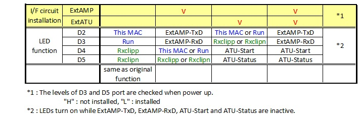

#Hermes-Lite Ver2 Beta5 Compact Transceiver firmware
[_VU2ZAZ's HL2 Companion board_](https://github.com/bnamnaidu/HL2-Companion-board-codec-and-Filter-)

##Based on the official 20180106 firmware.

##Iambic keyer and audio codec (sidetone)
- [_Keyer function_](https://github.com/ji1udd/Hermes-Lite/blob/6M/audiocodec/docs/Keyer_Sequece_and_setting.pdf)
- Mic gain (AK4951) : Normal 18dB, Boost 30dB
- Enable SPEAKER : [_Re-use "Random"_](https://github.com/ji1udd/Hermes-Lite2/blob/CompactTRX/compact-trx/Keyer_AK4951/docs/Speaker_Setting.jpg) on OpenHPSDR protocol.

##HL2 filter (1 HPF, 6 LPFs) control
- [_Alex / Apollo auto filter mode_](https://github.com/ji1udd/Hermes-Lite2/blob/CompactTRX/compact-trx/TX_RX_Filter/docs/Filter_Setting.jpg) ; HPF and LPFs are switched according to TX and multi RXs frequencies.
- Alex manual filter mode ; This mode is not supported by piHPSDR, but supported by [_PowerSDR_](CTRX_HL2b5/docs/PowerSDR_ALEX_ManualFilter_setting_for_Jims_Filter.jpg).
- Short switch latency for CW keyer operation.
- HPF is bypassed during TX.

##External amplifier band control
- Send TX frequency with Elecraft serial command "FA(VFO A frequency)" to ExtAMP.
- UART 9600bps
- Tested with HARDROCK-50
- UART RxD is not used.

##External ATU control
- Enable ATU : Use [_"Apollo auto tune"_](https://github.com/ji1udd/Hermes-Lite2/blob/CompactTRX/compact-trx/powercontrol/docs/ATU_Setting.jpg) on OpenHPSDR protocol.
- Send START trigger to ATU (like Start SW), Receive STATUS from ATU (like Tuning LED).
- [_Control sequence_](https://github.com/ji1udd/Hermes-Lite2/blob/CompactTRX/compact-trx/powercontrol/docs/ATU_timing_chart.jpg)
- Tested with ICOM AH-4

##LED Ports
- The function is automatically selected by ExtAMP/ExtATU interface circuit installation on board.

##Others
- Embedded PA is always enabled for a stand alone transceiver.
