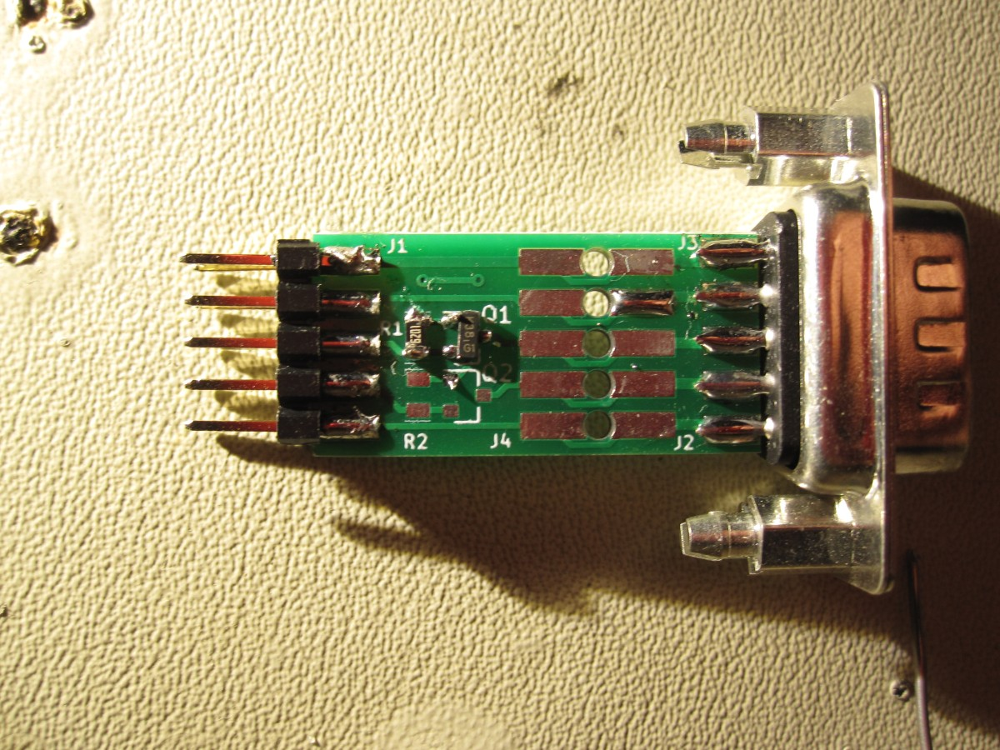

# BOM

The BOM below lists possible options for the DB9 adapter board. The builder should choose what components they need to buy and install.

| Reference | Quantity | Component |
| --------- | -------- | --------- |
| J3 | 1 | [DB-9 male](https://www.digikey.com/product-detail/en/edac-inc/627-009-220-047/151-1197-ND/1298747) |
| Q1, Q2 | 2 | [BSS138](https://www.digikey.com/product-detail/en/micro-commercial-co/BSS138W-TP/BSS138W-TPMSCT-ND/6616168) |
| R1, R2 | 2 | [10K 0805](https://www.digikey.com/product-detail/en/yageo/RC0805FR-0710KL/311-10.0KCRCT-ND/730482) |
| J1, J2, J4 | 1 | [5x2 male header](https://www.digikey.com/product-detail/en/sullins-connector-solutions/PRPC005DAAN-RC/S2011EC-05-ND/2775289) |

# Assembly

Please refer to the [schematic](db9.pdf) during assembly. 

Below is a picture of an assembled DB-9 IO board. Only one of the level shifter channels is installed, TX on pin 3 of the DB-9. This is all the that HR50 requires. The other level shifter can be installed if RX is required.

This assembly assumes a crossover cable. Install TX on the channel to the DB-9 pin 2 if a straight through cable is used.

The level shifter portion of the PCB can be broken off and jumpers to extra IO channels on the end plate can be used used instead. It is recommended to use the level shifters on the small DB-9 IO board, and the option to break the board may be removed in the future.

## Connection Diagram

