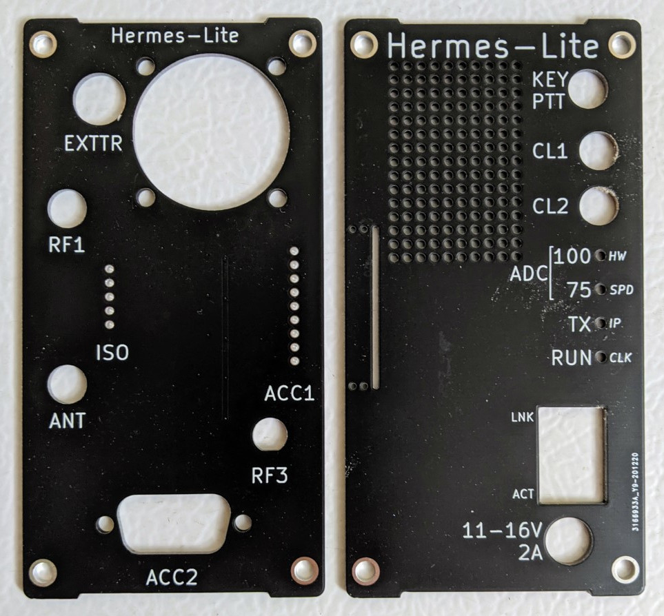
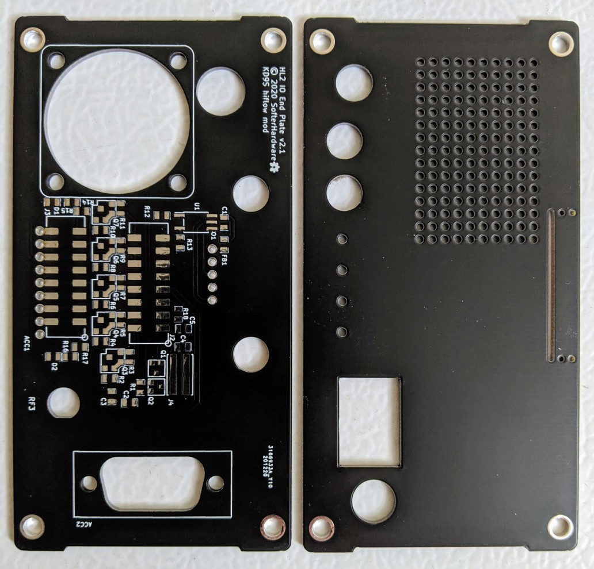

These endcaps are the same as KF7O's except I made modifications to increase airflow when a fan is used.

The highest flow 30mm fan currently available is [7.7CFM](https://www.digikey.com/en/products/detail/mechatronics-fan-group/MR3010E12B-RSR/7606131)

